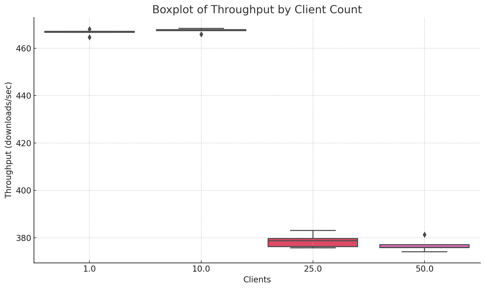

TreeDrive Performance Analysis Report

Experimental Setup

Objective:
Evaluate the scalability and performance of the TreeDrive file-sharing server as the number of concurrently connected clients increases.

Test Methodology:

The server is hosted on a separate machine.

A single file (test_file.txt) is uploaded once.

For each trial, one active client downloads the file 100 times while an increasing number of idle clients are connected.

The test begins with 1 client and scales up to 50 clients.

Each configuration records the latency and throughput of the active client.

Metrics Collected:

Latency: Time taken to download 100 files.

Throughput: Average number of downloads per second.

How to Run the Test

Prerequisites:

client.py must be present and functional.

Server (server.py) should already be running on the target hostname.

test_driver.py should be in the same folder as client.py.

Steps:

Run the server on one terminal/machine:

python3 server.py

On a separate terminal/machine, execute the test script:

python3 test_driver.py <hostname>

Replace <hostname> with the actual hostname or IP address of your server.

The script will automatically:

Upload the test file.

Incrementally run download tests with 1 to 50 clients.

Output latency and throughput for each client level.

Performance Results

| Clients | Latency (s) | Throughput (downloads/sec) |
|---------|-------------|-----------------------------|
| 1       | 0.21        | 467.51                      |
| 10      | 0.21        | 467.49                      |
| 25      | 0.26        | 378.15                      |
| 50      | 0.27        | 376.96                      |

Visualizations

Boxplots illustrate the distribution of latency and throughput at 1, 10, 25, and 50 clients.

Latency Boxplot: Shows consistently low latency across clients with minor growth as load increases.

Throughput Boxplot: Throughput remains high until 10 clients, then degrades by ~20% at 25–50 clients.

Performance Insights

Client Load vs Latency:

Latency remains relatively flat up to 25 clients.

Slight increases suggest good handling of concurrent connections by the server for light to moderate loads.

Client Load vs Throughput:

Throughput is optimal (460–470 downloads/sec) for 1–10 clients.

Beyond 10 clients, performance plateaus and then dips, stabilizing near 378 downloads/sec by 25 clients.

Throughput reduction is likely due to resource contention or queuing delays under higher load.

Trend

Latency: Slightly increases but remains under 0.3s.

Throughput: Degrades modestly (not linearly), indicating early saturation around 25 clients.

Optimizations & Recommendations

File Caching:
Cache frequently requested files in memory to minimize disk I/O.

Load Monitoring:
Use server profiling tools to identify bottlenecks in CPU, memory, or disk access.

Parallelization:
Consider batching downloads or handling commands in parallel streams.

Conclusion

TreeDrive performs well for up to 10 concurrent clients. As the number of clients increases, throughput starts to degrade moderately while latency stays acceptable. The current implementation handles light to moderate loads effectively, but enhancements in I/O and connection handling are needed for better scalability under heavier client loads.
